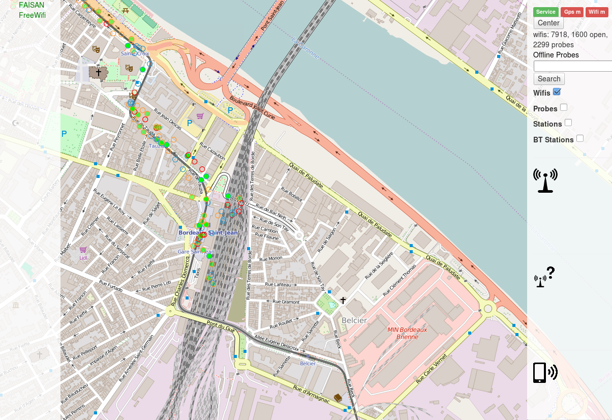
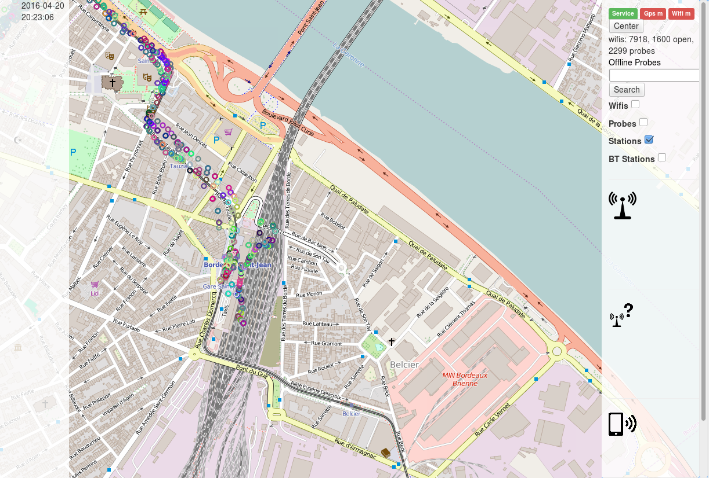
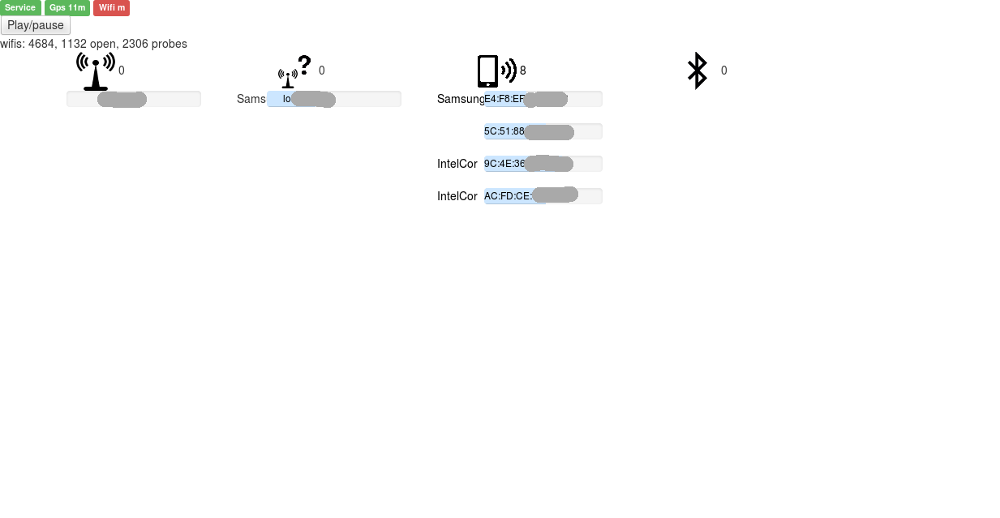
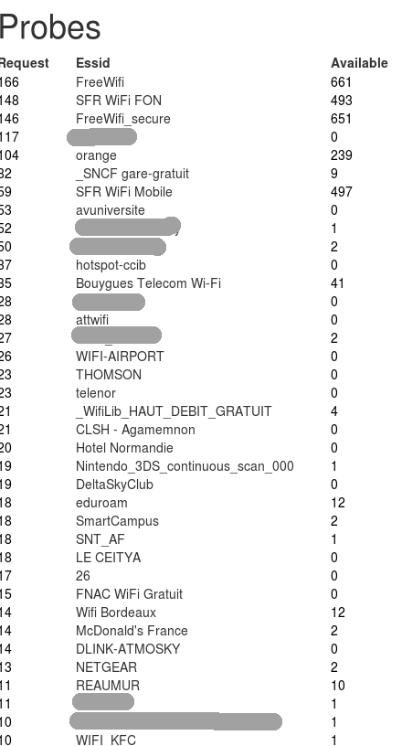
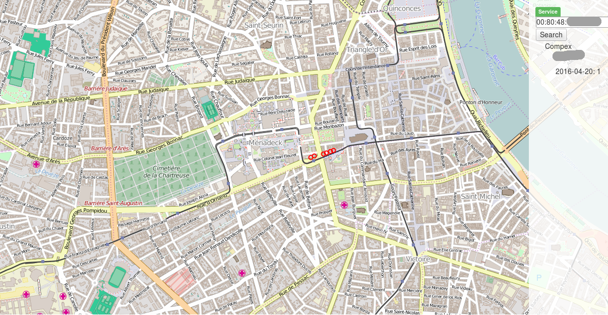

# WifiScanMap

Scan and map all 802.11 access point, stations probes and bluetooth peripherals

Initially inspired by https://github.com/cyberpython/WifiScanAndMap , this projects aims to play with common radio networks: wifi and Bluetooth.

Using tools such as iwlist, hcitool, or airmon-ng and a gpsd gps to logs data in an SQlite database, it provides a web HMI to monitor data processing and analyze already mapped data.

## installation
- bower install
- sudo apt install gpsd aircrack-ng bluez
- sudo python scanmap.py -m
- http://localhost:8686

## Features

- locate wifi acess point and its metadata bssid, essid, signal and encryption
- locate itself thanks to already known access points
- if using airmon-ng (-m otpion)
  - record all probe request: bssid, essid
  - record all stations: bssid, signal, date and position
- if hcitool is installed
  - record all bluetooth stations: bssid, name, classe, date and position
- synchronize data to a remote server (running the same program, with -e option)

It was tested on a raspberry pi 1 with a wifi and a blueatooth usb dongle.

## HMI
Angular / openlayers 3

### Main page
This page allow you to see your gps and wifi computed position on a map, and all access point already mapped.
Clicking on point gives you additional informations (date, bssid, encryption, manufacturer...)

You may also want to display all stations which crossed your way. Each point with the same color correspond to a uniq bssid

### Offline page
This page allows you to see currents datas received (probes, stations, access points...) without map in order to be available withou internet connection

### Probes page
On this page, you will see all probes request count and how many access point you know with this essid.

Clicking on a probe will display all mac addresses which made the request.

### Station page
This may be on of the more interesting one: given a station bssi, its location history will be displayed on the map, with all probed networks.
