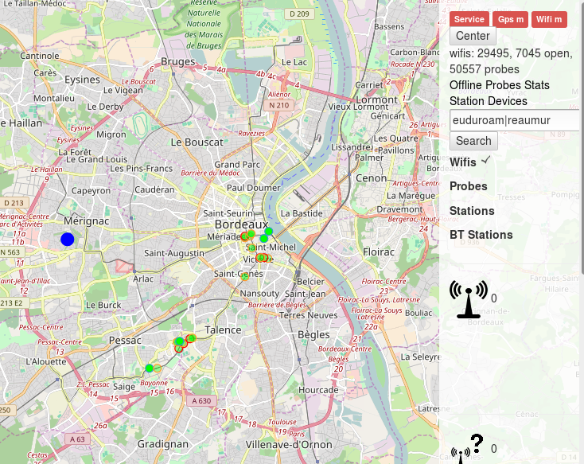
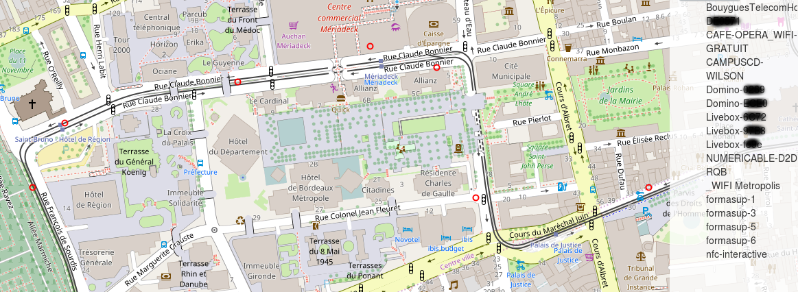

# Bordeaux: a digital urban exploration

You want to discover your city's public transport infrastructure? If people crossing your street are mainly tourists or neighbors? Check if you always take the tram with a given person who likes pizza and travels? Or maybe more when your neighbor is at home or not right now, and use to be there at this time?

## Wifi Dataset properties

- collected informations
    - wifi access points with position, encryption, bssid and date ( box, public access points... )
    - wifi stations with positions, bssid and date ( ie phones, embedded devices, computers... )
    - probes requests with bssid and date ( request from devices for a specific essid, see [here](https://wiki.freenetproject.org/Probes) for more information )
    - bluetooth devices, with position, class name and date

- dates

   ````
   select min(date), max(date) from wifis limit  1
   "2016-02-20 14:15:19"	"2016-10-11 13:40:33"
   ````

- Count

    ````
    select count(*) from wifis;
    29494
    ````

    ````
    select count(*) from wifis where encryption = 0;
    7044
    ````

    ````
    select count(*) from probes;
    118052
    ````

- Coverage:

  
  
## First, let's begin with some funny essid found, mainly in Bordeaux


## What if you wanted to add some semantic to your map with some ...

- fast foods

   

- public health

   
   
- universities

   

- Railroad stations

   

- Public transports infrastructure

   
   
   As we can see here, public transport have their own infrastructure with 393 devices embedded within public buses looking for BUSTBC, and 108 devices within trams looking for SSID_TRAM and Depot_001. Depot_001 was found close to "la bastide"

    You can even trace buses position


- Hotels

   

- Some french agencies ( Chambre de Commerce et d'Industrie de Bordeaux )

   

- The airport does not seems to be on the map but it should be somewhere around...

   

## Where people were connected before comming?

   

Mainly on public wifi, hotels and more than 633 from [Le Ceitya](http://www.hotel-leceitya.com/)


- 62 postmans using the [facteo](http://laposte.insa-rennes.fr/facteo/) service on a samsumg device


## What if you wanted to track people

### Through their bluetooth devices

   

   

### Through their wifi fingerprint

As with bluetouth, each device may be formally identified by its bssid. Thanks to that, I can be sure that this "men" took the A tram from Meriadek to Lycee Dagin the 14th july 2016 around 11am UTC. I never met him again.

   
   
This other "men" that I probably met once on the A tram seems to like dominos pizza, seems to travel around the world using [metropolis](https://www.wifimetropolis.com/fr) to stay connected and is sill learning at formasup.

   

You may ever find that some people on the tram are close friends because of their probes request.
For exemple Sonos unique network ssid may be a good clue: close friends may share their music on these devices

````select count(*) as count, essid from probes where essid like "sonos%" group by essid order by count DESC````

````
"count" "Essid"
"7"	"Sonos_uGUAzcgG5MiKVZHLXEYKt9dpUq"
"6"	"Sonos_0lg0ZdG5K83XtpaQJwRLPh9xy1"
"4"	"Sonos_LhNHzfI2obSstpRrQ9eHqdwzOG"
"4"	"Sonos_UMg5us2aiOPvDImCH5UhYncR3U"
"3"	"Sonos_Dyvs0V5MaULgQ1lOHtDNHj9mnH"
"3"	"Sonos_Jwk59FRebgm91DbJhoBturYHC5"
"3"	"Sonos_MzZ60CbYcrzizR8ltl98rkoJe9"
...
````

Don't forget that for each separate device, you are able to find where you scanned it, how many times, when and to wich other spot it was connected...

## Going further

- All these scan were mainly done thanks to 2 Raspberries pi, one with a serial GPS and an external battery pack, and the other at a fixed position to monitor people every day at the same place.
  But scanning more data at several city points in the same time to profile users and find people streams is also available with low cost devices such as esp8266. Using dns tunneling on available public networks, you can build cheaps scanners and drop them at some points of the city, to follow users, as explained in the [esp8266-wifiScanMap](https://github.com/mehdilauters/esp8266-wifiScanMap) project

  
  
- Associated with a more aggressive project, creating on-demand access point you can also improve your user profiling using dns queries, or even faking common protocols (pop, ftp...) as done on the following [wifi](https://github.com/JDRobotter/wifi) project.


